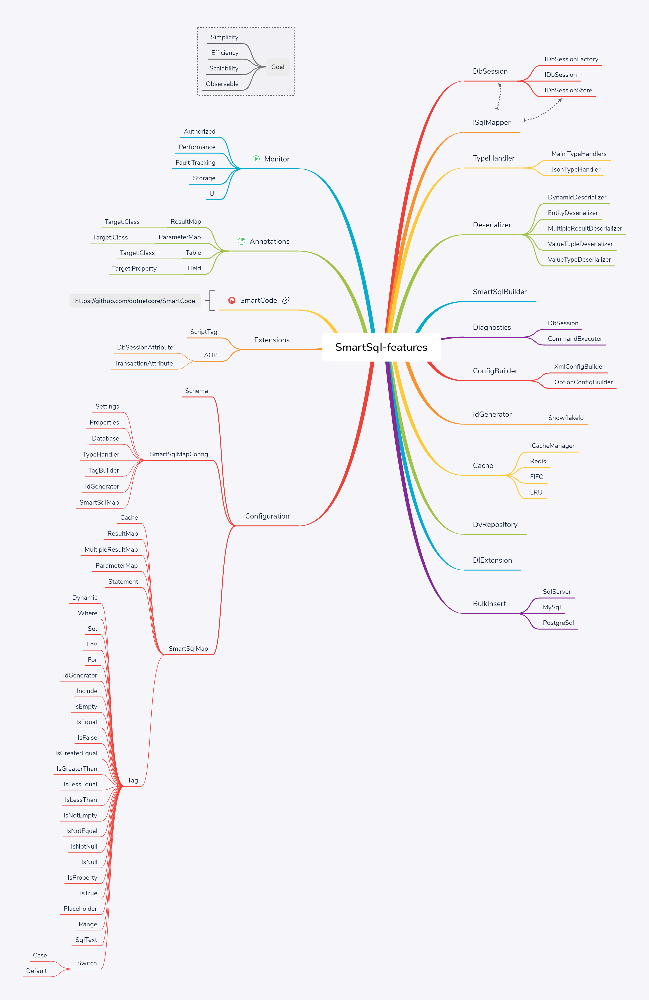

  

# 简介

 SmartSql = SmartSql = MyBatis + Cache(Memory | Redis) + ZooKeeper + R/W Splitting +Dynamic Repository + ......

## 主要特性

## 使用 [SmartCode](https://github.com/dotnetcore/SmartCode) 直接体验 [SmartSql](https://github.com/Smart-Kit/SmartSql)

## 示例项目

>建议感兴趣的同学可以用 [SmartCode](https://github.com/Ahoo-Wang/SmartCode) 配置好数据库链接，生成解决方案，直接 Run 来体验 SmartSql !

- <https://github.com/ElderJames/wizard-cinema>

## 文档贡献者

- [Ahoo-Wang](https://github.com/Ahoo-Wang)
- [RocherKong](https://github.com/RocherKong)
- [ElderJames](https://github.com/ElderJames)

## 技术交流

点击链接加入QQ群【SmartSql 官方交流群】：[604762592](https://jq.qq.com/?_wv=1027&k=5Sy8Ahw)