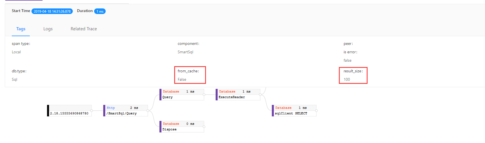
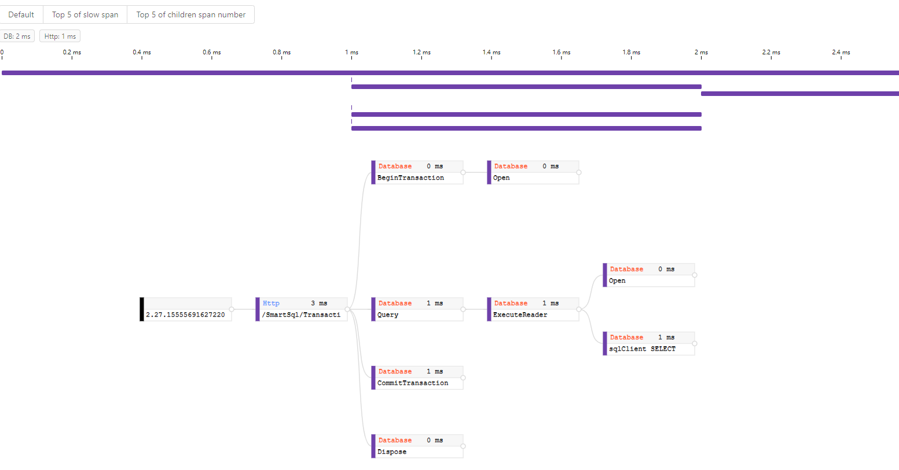
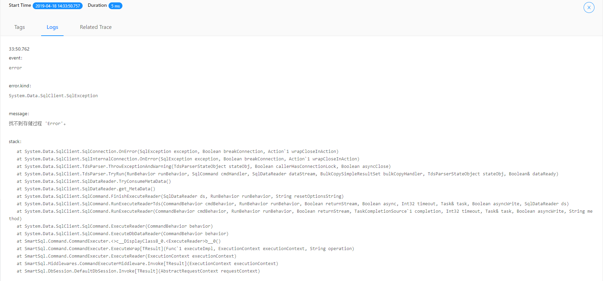

# Skywalking Monitoring

SmartSql currently supports Skywalking monitoring and is enabled by installing the [SkyAPM-dotnet](https://github.com/SkyAPM/SkyAPM-dotnet) agent. The following is a partial screenshot.

## Monitoring execution commands

### View whether the cache is cached and the number of records returned

### View executed SQL statements

## Transaction

## Error

### Exception stack Trace

